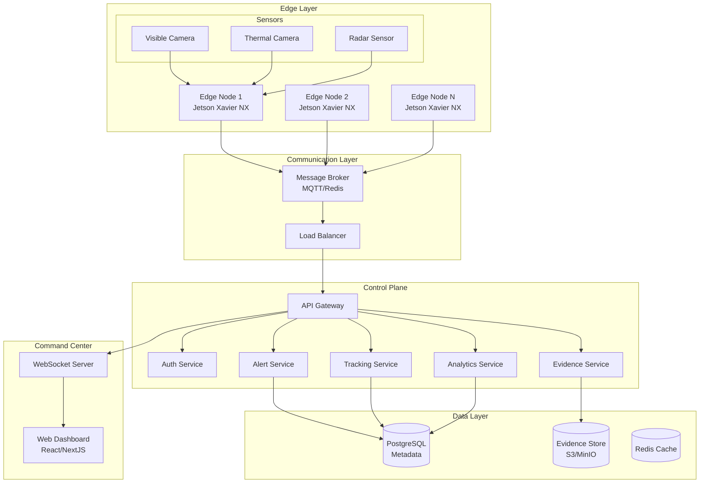

# Project Argus Border Detection System - Design Document

## Overview

Project Argus is a distributed, real-time border crossing detection system built on a microservices architecture with edge computing capabilities. The system combines advanced computer vision, multi-modal sensor fusion, and human-supervised response protocols to provide comprehensive border monitoring while maintaining strict privacy and security standards.

## Architecture

### High-Level Architecture



### Edge Computing Architecture

Each Edge Node runs containerized services for:
- **Detection Service**: Real-time person detection using YOLO/DETR models
- **Tracking Service**: Multi-object tracking with DeepSORT/ByteTrack
- **Re-ID Service**: Person re-identification across cameras
- **Sensor Fusion**: Multi-modal data integration
- **Virtual Line Engine**: Configurable boundary detection
- **Tamper Detection**: Camera integrity monitoring
- **Local Storage**: Offline capability and data buffering

## Components and Interfaces

### 1. Edge Detection Engine

**Technology Stack:**
- **Framework**: PyTorch/TensorRT for optimized inference
- **Models**: YOLOv8/YOLOv9 for detection, OSNet for Re-ID
- **Hardware Acceleration**: CUDA, TensorRT, OpenVINO
- **Container**: Docker with NVIDIA runtime

**Key Components:**
- `DetectionPipeline`: Main inference orchestrator
- `ModelManager`: Model loading and optimization
- `SensorFusion`: Multi-modal data integration
- `VirtualLineProcessor`: Boundary crossing detection
- `TamperDetector`: Camera integrity monitoring

**Interfaces:**
```python
class DetectionPipeline:
    def process_frame(self, frame: np.ndarray, camera_id: str) -> DetectionResult
    def update_virtual_lines(self, lines: List[VirtualLine]) -> bool
    def get_health_status(self) -> HealthStatus

class SensorFusion:
    def fuse_detections(self, visible: Detection, thermal: Detection, radar: RadarData) -> FusedDetection
    def adapt_to_conditions(self, lighting: float, weather: WeatherCondition) -> None
```

### 2. Tracking and Re-Identification System

**Technology Stack:**
- **Tracking**: ByteTrack/DeepSORT with Kalman filtering
- **Re-ID**: OSNet/FastReID with feature embeddings
- **Database**: Redis for real-time tracking state

**Key Components:**
- `MultiCameraTracker`: Cross-camera tracking coordination
- `ReIDMatcher`: Person re-identification engine
- `TrajectoryAnalyzer`: Movement pattern analysis
- `BehaviorAnalyzer`: Anomaly detection

**Interfaces:**
```python
class MultiCameraTracker:
    def update_tracks(self, detections: List[Detection], camera_id: str) -> List[Track]
    def match_across_cameras(self, track: Track) -> Optional[GlobalTrack]
    def get_trajectory(self, track_id: str) -> Trajectory

class ReIDMatcher:
    def extract_features(self, person_crop: np.ndarray) -> np.ndarray
    def match_person(self, features: np.ndarray, gallery: List[PersonFeatures]) -> MatchResult
```

### 3. Alert and Incident Management

**Technology Stack:**
- **Backend**: FastAPI/Flask with async processing
- **Message Queue**: Redis/RabbitMQ for alert distribution
- **Database**: PostgreSQL for incident records

**Key Components:**
- `AlertEngine`: Real-time alert generation and routing
- `IncidentManager`: Case creation and lifecycle management
- `EscalationService`: Automated escalation workflows
- `NotificationService`: Multi-channel alert delivery

**Interfaces:**
```python
class AlertEngine:
    def generate_alert(self, crossing_event: CrossingEvent) -> Alert
    def calculate_risk_score(self, event: CrossingEvent, context: ContextData) -> float
    def route_alert(self, alert: Alert) -> None

class IncidentManager:
    def create_incident(self, alert: Alert, operator_id: str) -> Incident
    def update_incident(self, incident_id: str, update: IncidentUpdate) -> Incident
    def close_incident(self, incident_id: str, resolution: Resolution) -> None
```

### 4. Command Center Dashboard

**Technology Stack:**
- **Frontend**: React 18 with TypeScript
- **State Management**: Redux Toolkit/Zustand
- **Real-time**: WebSocket with Socket.IO
- **UI Framework**: Material-UI/Ant Design
- **Maps**: Leaflet/Mapbox for geospatial visualization

**Key Components:**
- `LiveFeedViewer`: Real-time camera stream display
- `AlertDashboard`: Alert management interface
- `IncidentWorkflow`: Case management tools
- `AnalyticsDashboard`: Historical data visualization
- `SystemMonitor`: Health and status monitoring

**Interfaces:**
```typescript
interface LiveFeedViewer {
  displayCameraFeed(cameraId: string): void;
  overlayVirtualLines(lines: VirtualLine[]): void;
  showDetectionBoxes(detections: Detection[]): void;
  handleAlertClick(alert: Alert): void;
}

interface AlertDashboard {
  displayAlerts(alerts: Alert[]): void;
  filterAlerts(criteria: FilterCriteria): Alert[];
  acknowledgeAlert(alertId: string): void;
  escalateAlert(alertId: string, reason: string): void;
}
```

### 5. Evidence Management System

**Technology Stack:**
- **Storage**: MinIO/S3 for object storage
- **Encryption**: AES-256 for data at rest
- **Integrity**: HMAC-SHA256 for tamper detection
- **Database**: PostgreSQL for metadata

**Key Components:**
- `EvidenceStore`: Immutable evidence storage
- `ForensicsEngine`: Automated report generation
- `AuditLogger`: Comprehensive audit trails
- `RetentionManager`: Automated data lifecycle

**Interfaces:**
```python
class EvidenceStore:
    def store_evidence(self, evidence: Evidence) -> str
    def retrieve_evidence(self, evidence_id: str) -> Evidence
    def verify_integrity(self, evidence_id: str) -> bool
    def generate_chain_of_custody(self, evidence_id: str) -> ChainOfCustody

class ForensicsEngine:
    def generate_report(self, incident_id: str) -> ForensicsReport
    def create_video_summary(self, evidence_ids: List[str]) -> VideoSummary
    def export_legal_package(self, incident_id: str) -> LegalPackage
```

## Data Models

### Core Entities

```python
@dataclass
class Detection:
    id: str
    camera_id: str
    timestamp: datetime
    bbox: BoundingBox
    confidence: float
    features: np.ndarray
    image_crop: Optional[bytes]

@dataclass
class Track:
    id: str
    detections: List[Detection]
    trajectory: List[Point]
    start_time: datetime
    end_time: Optional[datetime]
    status: TrackStatus

@dataclass
class Alert:
    id: str
    type: AlertType
    severity: Severity
    camera_id: str
    detection_id: str
    timestamp: datetime
    confidence: float
    risk_score: float
    metadata: Dict[str, Any]

@dataclass
class Incident:
    id: str
    alert_id: str
    operator_id: str
    status: IncidentStatus
    created_at: datetime
    updated_at: datetime
    evidence_ids: List[str]
    notes: List[Note]
    resolution: Optional[Resolution]

@dataclass
class VirtualLine:
    id: str
    camera_id: str
    points: List[Point]
    direction: CrossingDirection
    sensitivity: float
    active: bool
```

### Database Schema

```sql
-- Core tables
CREATE TABLE cameras (
    id UUID PRIMARY KEY,
    name VARCHAR(255) NOT NULL,
    location POINT NOT NULL,
    type VARCHAR(50) NOT NULL,
    status VARCHAR(20) DEFAULT 'active',
    created_at TIMESTAMP DEFAULT NOW()
);

CREATE TABLE detections (
    id UUID PRIMARY KEY,
    camera_id UUID REFERENCES cameras(id),
    timestamp TIMESTAMP NOT NULL,
    bbox JSONB NOT NULL,
    confidence FLOAT NOT NULL,
    features BYTEA,
    image_path VARCHAR(500),
    created_at TIMESTAMP DEFAULT NOW()
);

CREATE TABLE tracks (
    id UUID PRIMARY KEY,
    global_id UUID,
    camera_id UUID REFERENCES cameras(id),
    start_time TIMESTAMP NOT NULL,
    end_time TIMESTAMP,
    trajectory JSONB,
    status VARCHAR(20) DEFAULT 'active',
    created_at TIMESTAMP DEFAULT NOW()
);

CREATE TABLE alerts (
    id UUID PRIMARY KEY,
    type VARCHAR(50) NOT NULL,
    severity VARCHAR(20) NOT NULL,
    camera_id UUID REFERENCES cameras(id),
    detection_id UUID REFERENCES detections(id),
    timestamp TIMESTAMP NOT NULL,
    confidence FLOAT NOT NULL,
    risk_score FLOAT NOT NULL,
    metadata JSONB,
    acknowledged BOOLEAN DEFAULT FALSE,
    created_at TIMESTAMP DEFAULT NOW()
);

CREATE TABLE incidents (
    id UUID PRIMARY KEY,
    alert_id UUID REFERENCES alerts(id),
    operator_id UUID REFERENCES users(id),
    status VARCHAR(20) DEFAULT 'open',
    priority VARCHAR(20) DEFAULT 'medium',
    created_at TIMESTAMP DEFAULT NOW(),
    updated_at TIMESTAMP DEFAULT NOW(),
    closed_at TIMESTAMP
);

CREATE TABLE evidence (
    id UUID PRIMARY KEY,
    incident_id UUID REFERENCES incidents(id),
    type VARCHAR(50) NOT NULL,
    file_path VARCHAR(500) NOT NULL,
    hash VARCHAR(128) NOT NULL,
    signature VARCHAR(256) NOT NULL,
    metadata JSONB,
    created_at TIMESTAMP DEFAULT NOW()
);

-- Indexes for performance
CREATE INDEX idx_detections_camera_timestamp ON detections(camera_id, timestamp);
CREATE INDEX idx_alerts_timestamp ON alerts(timestamp);
CREATE INDEX idx_tracks_camera_time ON tracks(camera_id, start_time);
```

## Error Handling

### Edge Node Resilience

1. **Network Disconnection**:
   - Local buffering of alerts and evidence
   - Automatic reconnection with exponential backoff
   - Offline mode with local storage

2. **Hardware Failures**:
   - Graceful degradation with sensor failures
   - Automatic failover to backup cameras
   - Health monitoring with predictive maintenance

3. **Model Loading Errors**:
   - Fallback to lighter models
   - Model validation before deployment
   - Rollback capabilities for failed updates

### System-Wide Error Handling

```python
class ErrorHandler:
    def handle_detection_error(self, error: Exception, context: DetectionContext) -> None
    def handle_network_error(self, error: NetworkError) -> None
    def handle_storage_error(self, error: StorageError) -> None
    def escalate_critical_error(self, error: CriticalError) -> None

class CircuitBreaker:
    def __init__(self, failure_threshold: int, recovery_timeout: int)
    def call(self, func: Callable) -> Any
    def is_open(self) -> bool
    def reset(self) -> None
```

## Testing Strategy

### Unit Testing
- **Detection Pipeline**: Mock camera inputs, validate detection accuracy
- **Tracking System**: Synthetic trajectories, re-ID matching tests
- **Alert Engine**: Rule-based alert generation validation
- **Evidence Store**: Integrity verification, encryption validation

### Integration Testing
- **End-to-End Workflows**: Camera → Detection → Alert → Incident
- **Multi-Camera Scenarios**: Cross-camera tracking validation
- **Failure Scenarios**: Network loss, hardware failures
- **Performance Testing**: Latency, throughput, resource usage

### Test Data and Scenarios
```python
# Test scenarios
test_scenarios = [
    "single_person_crossing",
    "multiple_simultaneous_crossings", 
    "night_vision_detection",
    "thermal_only_detection",
    "camera_occlusion_tamper",
    "network_disconnection",
    "false_positive_filtering",
    "re_identification_accuracy"
]

# Performance benchmarks
performance_targets = {
    "detection_latency": "< 300ms",
    "false_positive_rate": "< 1/camera/day",
    "re_id_accuracy": "> 95%",
    "system_uptime": "> 99.9%"
}
```

### Continuous Testing
- **Automated CI/CD**: GitHub Actions with model validation
- **Stress Testing**: Simulated high-traffic scenarios
- **Security Testing**: Penetration testing, vulnerability scans
- **Performance Monitoring**: Real-time metrics and alerting

## Security Architecture

### Zero-Trust Implementation
- **Network Segmentation**: Micro-segmentation with firewall rules
- **Identity Verification**: mTLS for service-to-service communication
- **Least Privilege**: Role-based access with minimal permissions
- **Continuous Monitoring**: Real-time security event detection

### Encryption Strategy
```python
class SecurityManager:
    def encrypt_data_at_rest(self, data: bytes) -> EncryptedData
    def encrypt_data_in_transit(self, data: bytes) -> bytes
    def sign_evidence(self, evidence: Evidence) -> Signature
    def verify_integrity(self, data: bytes, signature: Signature) -> bool
    def rotate_keys(self) -> None

# Key management
class KeyManager:
    def generate_key_pair(self) -> KeyPair
    def rotate_encryption_keys(self) -> None
    def secure_key_storage(self, key: Key) -> None
    def audit_key_usage(self) -> AuditLog
```

### Access Control Matrix
```yaml
roles:
  operator:
    permissions:
      - view_live_feeds
      - acknowledge_alerts
      - create_incidents
      - view_evidence
  
  auditor:
    permissions:
      - view_audit_logs
      - view_evidence
      - generate_reports
      - read_only_access
  
  administrator:
    permissions:
      - all_operator_permissions
      - configure_system
      - manage_users
      - system_maintenance
```

This design provides a robust, scalable, and secure foundation for Project Argus while maintaining the flexibility to adapt to evolving requirements and technologies.