# Project Argus Component Interactions

## Overview

This document details the interactions between different components of Project Argus, including data flows, communication patterns, and integration points. Understanding these interactions is crucial for system maintenance, troubleshooting, and future enhancements.

## Component Interaction Map

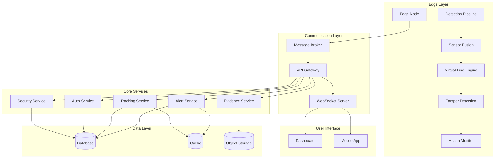

## Detailed Component Interactions

### 1. Edge Node to Control Plane

#### Detection Event Flow
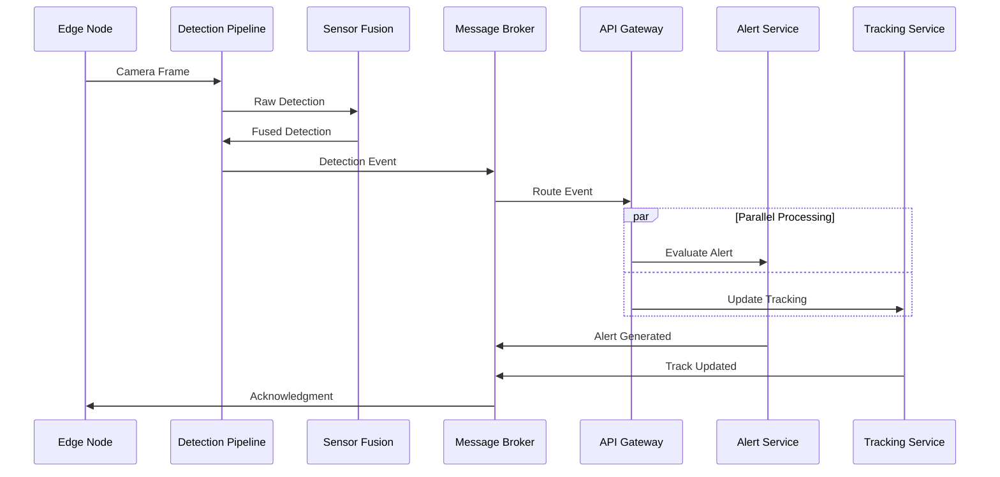

**Message Format**:
```json
{
  "event_id": "evt-12345",
  "event_type": "detection",
  "timestamp": "2024-01-15T10:30:00.123Z",
  "source": {
    "edge_node_id": "edge-001",
    "camera_id": "cam-001"
  },
  "detection": {
    "id": "det-67890",
    "bbox": {"x": 100, "y": 200, "width": 150, "height": 300},
    "confidence": 0.95,
    "class": "person",
    "features": "base64_encoded_vector"
  },
  "sensor_data": {
    "visible": {"confidence": 0.95, "bbox": {...}},
    "thermal": {"confidence": 0.87, "bbox": {...}},
    "radar": {"range": 45.2, "velocity": 1.2}
  },
  "virtual_line": {
    "crossed": true,
    "line_id": "vl-001",
    "direction": "inbound"
  },
  "metadata": {
    "processing_time_ms": 45,
    "model_version": "yolov8n-v1.2",
    "gpu_utilization": 0.75
  }
}
```

#### Health Monitoring Flow
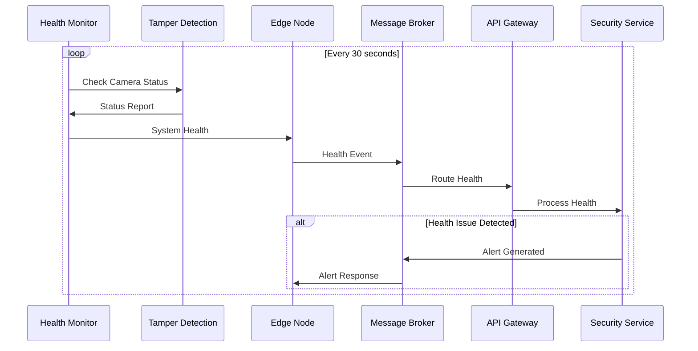

### 2. Alert Processing Workflow

#### Alert Generation and Escalation
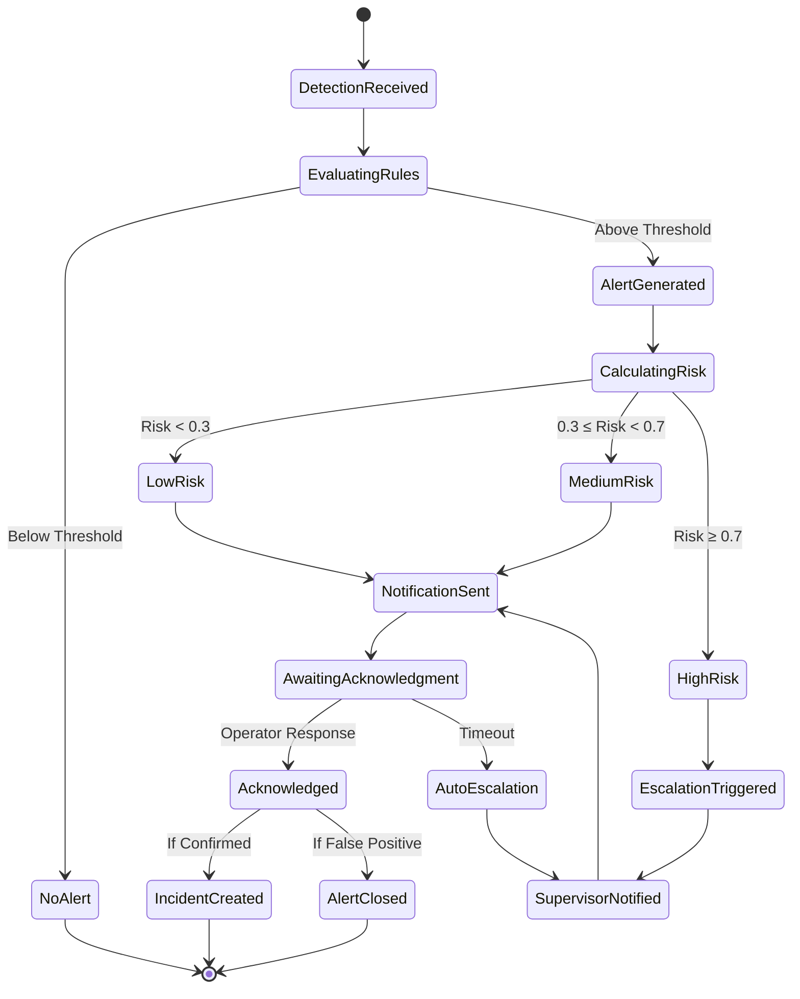

**Alert Service Implementation**:
```python
class AlertService:
    async def process_detection(self, detection_event: DetectionEvent) -> Optional[Alert]:
        # Step 1: Evaluate detection against rules
        rule_results = await self.rule_engine.evaluate(detection_event)
        
        if not rule_results.should_alert:
            return None
        
        # Step 2: Calculate risk score
        risk_score = await self.risk_calculator.calculate(
            detection_event, 
            rule_results.context
        )
        
        # Step 3: Create alert
        alert = Alert(
            id=generate_uuid(),
            type=rule_results.alert_type,
            severity=self._determine_severity(risk_score),
            detection_id=detection_event.detection.id,
            camera_id=detection_event.source.camera_id,
            risk_score=risk_score,
            timestamp=detection_event.timestamp
        )
        
        # Step 4: Store alert
        await self.alert_repository.save(alert)
        
        # Step 5: Send notifications
        await self.notification_service.send_alert(alert)
        
        # Step 6: Handle escalation if needed
        if alert.severity >= Severity.HIGH:
            await self.escalation_service.escalate(alert)
        
        return alert
```

### 3. Tracking System Interactions

#### Multi-Camera Tracking Flow
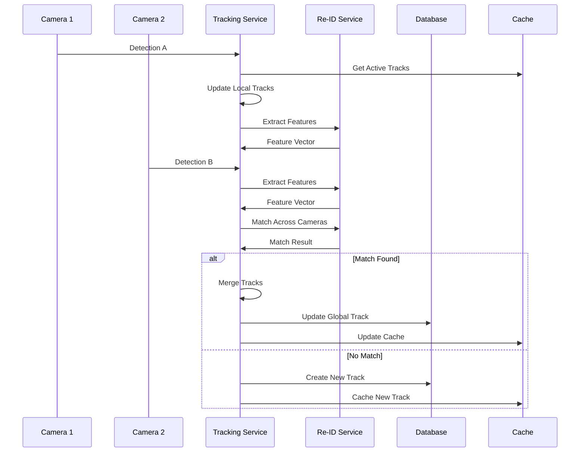

**Tracking Service Implementation**:
```python
class TrackingService:
    async def update_tracks(self, detection: Detection) -> List[Track]:
        # Get active tracks for camera
        active_tracks = await self.cache.get_active_tracks(detection.camera_id)
        
        # Update local tracking
        updated_tracks = self.local_tracker.update(detection, active_tracks)
        
        # Perform re-identification
        for track in updated_tracks:
            if track.is_new:
                # Extract features for new track
                features = await self.reid_service.extract_features(
                    detection.image_crop
                )
                track.features = features
                
                # Try to match with existing global tracks
                match = await self.reid_service.match_global(features)
                
                if match:
                    # Merge with existing global track
                    await self.merge_tracks(track, match.global_track)
                else:
                    # Create new global track
                    await self.create_global_track(track)
        
        # Update cache
        await self.cache.update_tracks(detection.camera_id, updated_tracks)
        
        return updated_tracks
```

### 4. Evidence Management Flow

#### Evidence Storage and Retrieval
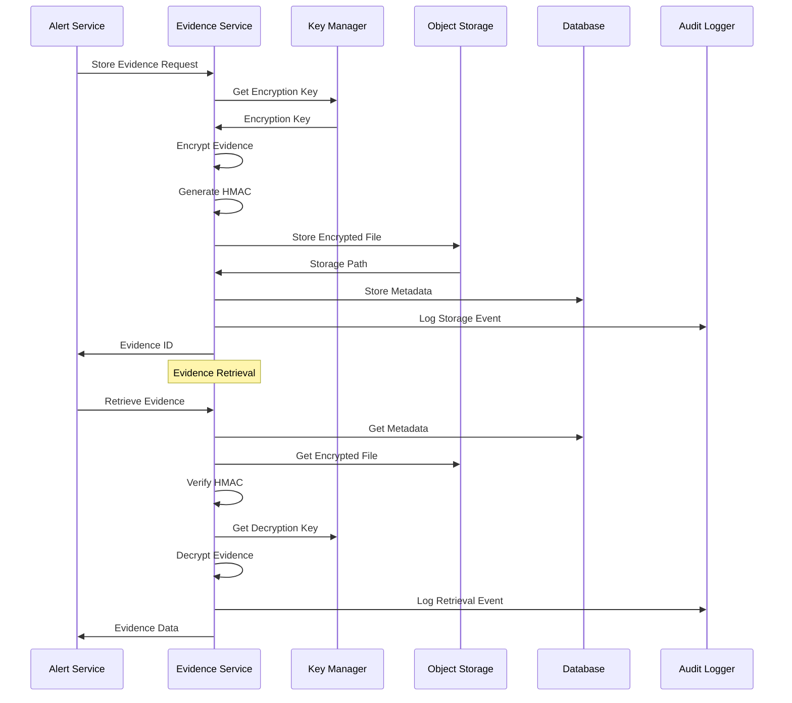

**Evidence Service Implementation**:
```python
class EvidenceService:
    async def store_evidence(self, evidence: Evidence) -> str:
        # Generate unique evidence ID
        evidence_id = generate_uuid()
        
        # Get encryption key
        encryption_key = await self.key_manager.get_current_key()
        
        # Encrypt evidence data
        encrypted_data = self.crypto.encrypt(evidence.data, encryption_key)
        
        # Generate HMAC for integrity
        hmac_signature = self.crypto.generate_hmac(
            encrypted_data, 
            encryption_key
        )
        
        # Store in object storage
        storage_path = await self.storage.store(
            f"evidence/{evidence_id}",
            encrypted_data
        )
        
        # Store metadata in database
        metadata = EvidenceMetadata(
            id=evidence_id,
            incident_id=evidence.incident_id,
            type=evidence.type,
            storage_path=storage_path,
            hash=self.crypto.hash(evidence.data),
            signature=hmac_signature,
            created_at=datetime.utcnow()
        )
        
        await self.repository.save(metadata)
        
        # Log audit event
        await self.audit_logger.log_evidence_storage(
            evidence_id=evidence_id,
            operator_id=evidence.operator_id,
            action="STORE"
        )
        
        return evidence_id
```

### 5. Dashboard Real-Time Updates

#### WebSocket Communication Flow
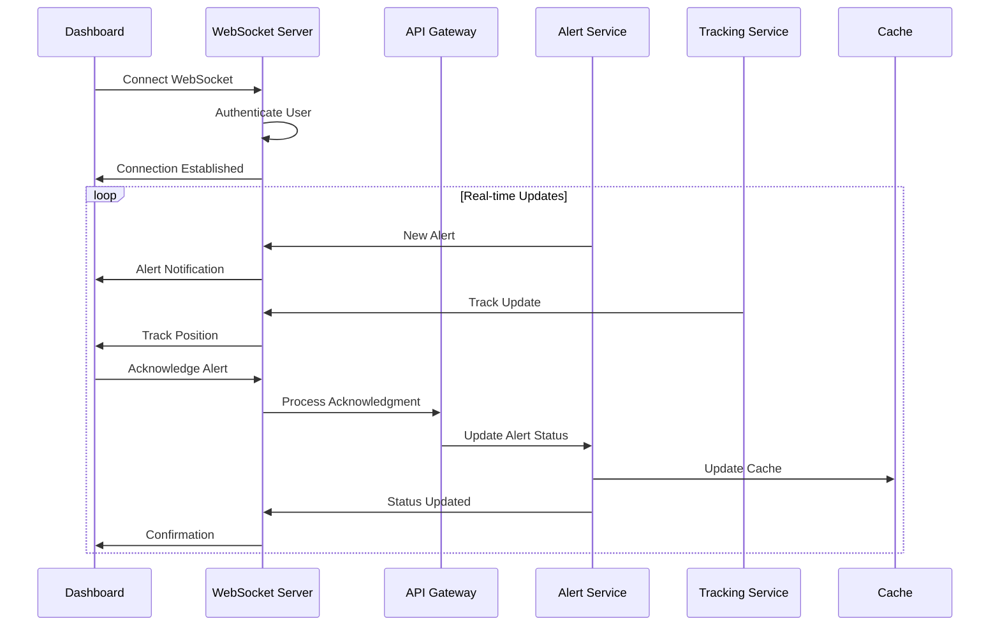

**WebSocket Server Implementation**:
```python
class WebSocketServer:
    def __init__(self):
        self.connections = {}
        self.subscriptions = {}
    
    async def handle_connection(self, websocket, path):
        # Authenticate user
        token = await self.authenticate(websocket)
        user_id = self.jwt_service.decode_token(token)['user_id']
        
        # Store connection
        self.connections[user_id] = websocket
        
        try:
            async for message in websocket:
                await self.handle_message(user_id, message)
        except websockets.exceptions.ConnectionClosed:
            pass
        finally:
            # Clean up connection
            del self.connections[user_id]
    
    async def broadcast_alert(self, alert: Alert):
        # Get users who should receive this alert
        authorized_users = await self.get_authorized_users(alert)
        
        message = {
            "type": "alert",
            "data": alert.to_dict()
        }
        
        # Send to all authorized connected users
        for user_id in authorized_users:
            if user_id in self.connections:
                await self.connections[user_id].send(json.dumps(message))
```

### 6. Security Service Interactions

#### Authentication and Authorization Flow
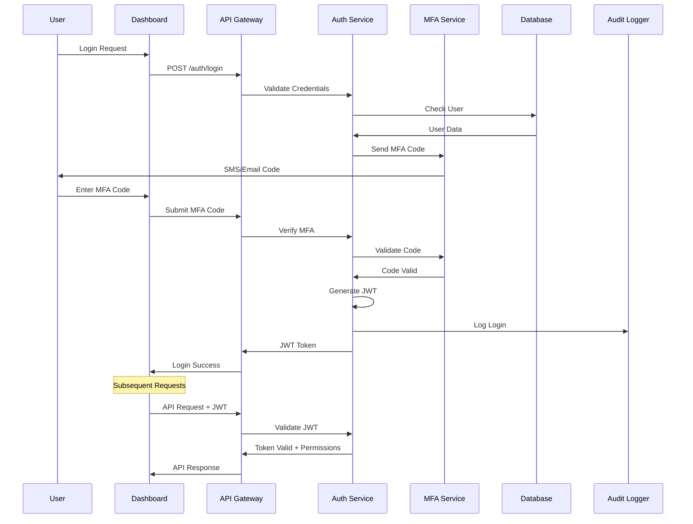

### 7. Data Synchronization Patterns

#### Edge-to-Cloud Synchronization
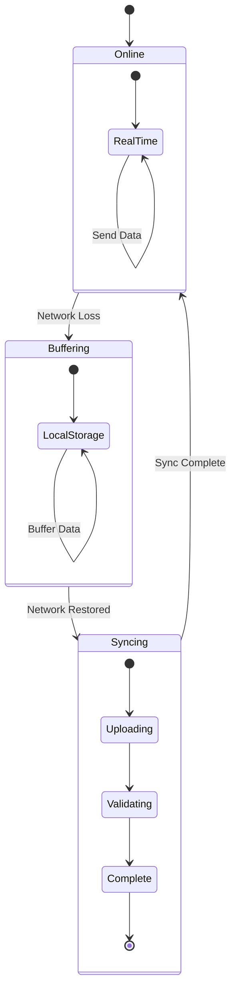

**Edge Synchronization Implementation**:
```python
class EdgeSynchronizer:
    def __init__(self):
        self.buffer = LocalBuffer()
        self.network_monitor = NetworkMonitor()
        self.sync_queue = asyncio.Queue()
    
    async def send_data(self, data: dict):
        if self.network_monitor.is_online():
            # Send immediately
            try:
                await self.api_client.send(data)
            except NetworkError:
                # Network failed, buffer data
                await self.buffer.store(data)
                self.network_monitor.set_offline()
        else:
            # Buffer data for later sync
            await self.buffer.store(data)
    
    async def sync_buffered_data(self):
        """Sync buffered data when network is restored"""
        while not self.buffer.is_empty():
            batch = await self.buffer.get_batch(100)
            
            try:
                await self.api_client.send_batch(batch)
                await self.buffer.mark_synced(batch)
            except NetworkError:
                # Network failed again, stop syncing
                self.network_monitor.set_offline()
                break
```

### 8. Error Handling and Recovery

#### Circuit Breaker Pattern
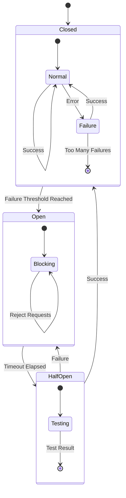

**Circuit Breaker Implementation**:
```python
class CircuitBreaker:
    def __init__(self, failure_threshold=5, recovery_timeout=60):
        self.failure_threshold = failure_threshold
        self.recovery_timeout = recovery_timeout
        self.failure_count = 0
        self.last_failure_time = None
        self.state = CircuitState.CLOSED
    
    async def call(self, func, *args, **kwargs):
        if self.state == CircuitState.OPEN:
            if self._should_attempt_reset():
                self.state = CircuitState.HALF_OPEN
            else:
                raise CircuitBreakerOpenError()
        
        try:
            result = await func(*args, **kwargs)
            self._on_success()
            return result
        except Exception as e:
            self._on_failure()
            raise e
    
    def _on_success(self):
        self.failure_count = 0
        self.state = CircuitState.CLOSED
    
    def _on_failure(self):
        self.failure_count += 1
        self.last_failure_time = time.time()
        
        if self.failure_count >= self.failure_threshold:
            self.state = CircuitState.OPEN
```

### 9. Performance Optimization Patterns

#### Caching Strategy
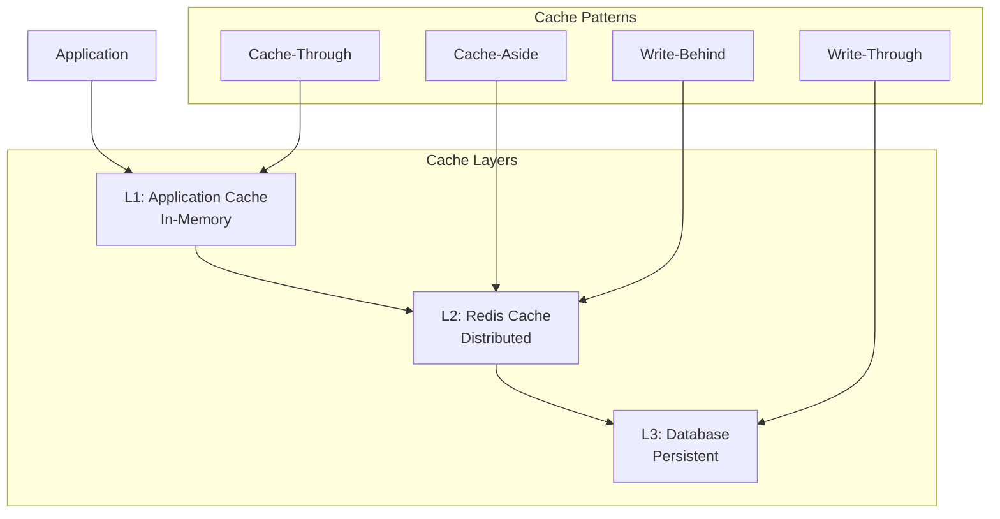

**Multi-Level Caching Implementation**:
```python
class CacheManager:
    def __init__(self):
        self.l1_cache = {}  # In-memory cache
        self.l2_cache = RedisCache()  # Distributed cache
        self.database = Database()  # Persistent storage
    
    async def get(self, key: str) -> Optional[Any]:
        # Try L1 cache first
        if key in self.l1_cache:
            return self.l1_cache[key]
        
        # Try L2 cache
        value = await self.l2_cache.get(key)
        if value:
            # Populate L1 cache
            self.l1_cache[key] = value
            return value
        
        # Fallback to database
        value = await self.database.get(key)
        if value:
            # Populate both cache levels
            self.l1_cache[key] = value
            await self.l2_cache.set(key, value, ttl=3600)
            return value
        
        return None
    
    async def set(self, key: str, value: Any, ttl: int = 3600):
        # Write-through pattern
        await self.database.set(key, value)
        await self.l2_cache.set(key, value, ttl)
        self.l1_cache[key] = value
```

## Integration Points

### External System Integrations

#### Indian Border Security Systems
```python
class BorderSecurityIntegration:
    """Integration with Indian military and paramilitary systems"""
    
    async def send_alert_to_bsf(self, alert: Alert):
        """Send alert to Border Security Force systems"""
        bsf_alert = {
            "alert_id": alert.id,
            "location": alert.camera.location,
            "timestamp": alert.timestamp.isoformat(),
            "severity": alert.severity.value,
            "description": f"Border crossing detected at {alert.camera.name}"
        }
        
        await self.bsf_client.send_alert(bsf_alert)
    
    async def coordinate_response(self, incident: Incident):
        """Coordinate response with military units"""
        response_request = {
            "incident_id": incident.id,
            "location": incident.alert.camera.location,
            "recommended_action": incident.recommended_action,
            "priority": incident.priority.value
        }
        
        await self.military_coordination.request_response(response_request)
```

This comprehensive documentation of component interactions provides the foundation for understanding, maintaining, and extending the Project Argus system.