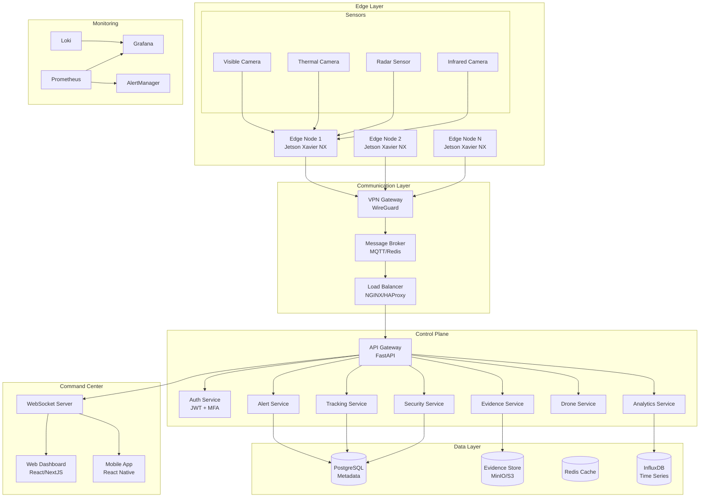
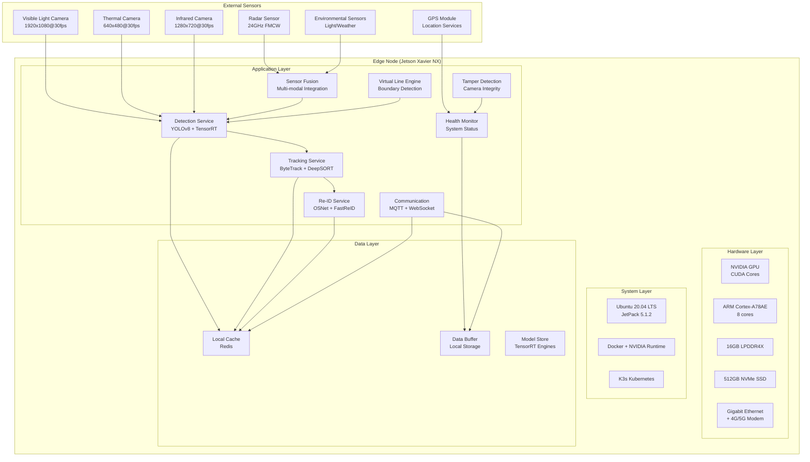
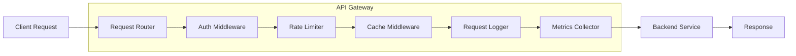
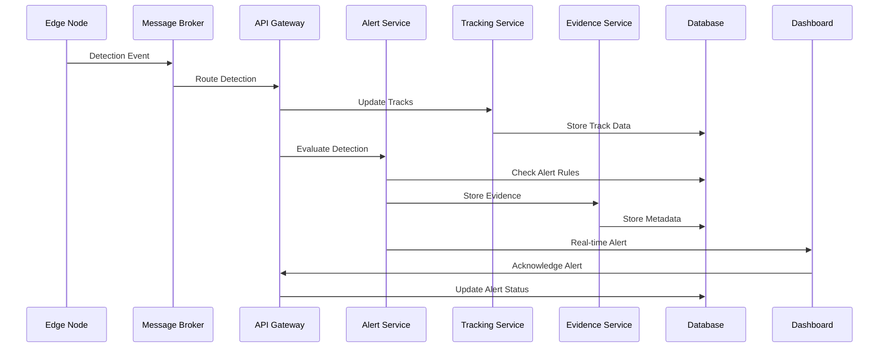
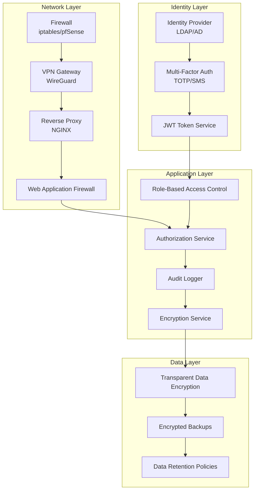
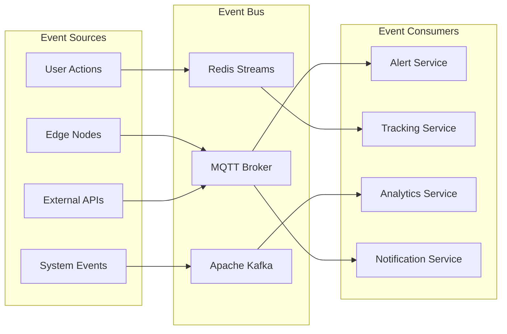

# Project Argus System Architecture

## Overview

Project Argus is a distributed, real-time border crossing detection system built on a microservices architecture with edge computing capabilities. The system combines advanced computer vision, multi-modal sensor fusion, and human-supervised response protocols to provide comprehensive border monitoring while maintaining strict privacy and security standards.

## Architecture Principles

### Design Philosophy
- **Edge-First Computing**: Processing at the source to minimize latency and bandwidth
- **Human-in-the-Loop**: All critical decisions require human authorization
- **Privacy by Design**: Data minimization and automatic purging of unconfirmed incidents
- **Zero-Trust Security**: Every component and communication is authenticated and encrypted
- **Fault Tolerance**: Graceful degradation and automatic recovery capabilities
- **Scalability**: Horizontal scaling to support hundreds of cameras and edge nodes

### Quality Attributes
- **Performance**: Sub-300ms detection latency, 99.9% uptime
- **Security**: End-to-end encryption, role-based access control, audit logging
- **Reliability**: Automatic failover, data integrity verification, redundant storage
- **Maintainability**: Containerized services, comprehensive monitoring, automated deployment
- **Usability**: Intuitive dashboard, real-time alerts, streamlined workflows

## High-Level Architecture



## Component Architecture

### Edge Computing Layer

#### Edge Node Architecture


#### Edge Services

**Detection Service**
- **Purpose**: Real-time person detection using optimized AI models
- **Technology**: YOLOv8/YOLOv9 with TensorRT optimization
- **Performance**: <300ms latency, 95%+ accuracy
- **Features**: Multi-class detection, confidence scoring, bounding box extraction

**Tracking Service**
- **Purpose**: Multi-object tracking across frames and cameras
- **Technology**: ByteTrack/DeepSORT with Kalman filtering
- **Features**: Track lifecycle management, trajectory prediction, cross-camera association

**Re-Identification Service**
- **Purpose**: Person re-identification across multiple cameras
- **Technology**: OSNet/FastReID with feature embeddings
- **Features**: Feature extraction, similarity matching, gallery management

**Sensor Fusion Service**
- **Purpose**: Multi-modal sensor data integration
- **Technology**: Adaptive fusion algorithms
- **Features**: Automatic mode switching, environmental adaptation, data correlation

### Control Plane Services

#### API Gateway


**Features**:
- Request routing and load balancing
- Authentication and authorization
- Rate limiting and throttling
- Response caching
- Request/response logging
- Metrics collection
- Circuit breaker pattern

#### Microservices Architecture

**Alert Service**
```python
class AlertService:
    """
    Handles alert generation, routing, and escalation
    """
    def __init__(self):
        self.alert_engine = AlertEngine()
        self.notification_service = NotificationService()
        self.escalation_service = EscalationService()
    
    async def process_detection(self, detection: Detection) -> Optional[Alert]:
        # Generate alert based on detection
        alert = await self.alert_engine.evaluate_detection(detection)
        
        if alert:
            # Route alert to appropriate channels
            await self.notification_service.send_alert(alert)
            
            # Handle escalation if needed
            if alert.severity >= Severity.HIGH:
                await self.escalation_service.escalate(alert)
        
        return alert
```

**Tracking Service**
```python
class TrackingService:
    """
    Manages global tracking across all cameras
    """
    def __init__(self):
        self.global_tracker = GlobalTracker()
        self.reid_matcher = ReIDMatcher()
        self.trajectory_analyzer = TrajectoryAnalyzer()
    
    async def update_tracks(self, detections: List[Detection]) -> List[Track]:
        # Update local tracks
        local_tracks = await self.global_tracker.update(detections)
        
        # Perform cross-camera matching
        global_tracks = await self.reid_matcher.match_across_cameras(local_tracks)
        
        # Analyze trajectories for patterns
        await self.trajectory_analyzer.analyze_patterns(global_tracks)
        
        return global_tracks
```

**Evidence Service**
```python
class EvidenceService:
    """
    Manages immutable evidence storage and forensics
    """
    def __init__(self):
        self.evidence_store = EvidenceStore()
        self.forensics_engine = ForensicsEngine()
        self.audit_logger = AuditLogger()
    
    async def store_evidence(self, evidence: Evidence) -> str:
        # Sign evidence with HMAC
        signed_evidence = await self.evidence_store.sign_evidence(evidence)
        
        # Store with encryption
        evidence_id = await self.evidence_store.store(signed_evidence)
        
        # Log audit trail
        await self.audit_logger.log_evidence_storage(evidence_id, evidence.metadata)
        
        return evidence_id
```

### Data Architecture

#### Database Design
```sql
-- Core entity relationships
CREATE TABLE cameras (
    id UUID PRIMARY KEY DEFAULT gen_random_uuid(),
    name VARCHAR(255) NOT NULL,
    location POINT NOT NULL,
    type camera_type NOT NULL,
    status camera_status DEFAULT 'active',
    configuration JSONB,
    created_at TIMESTAMP DEFAULT NOW(),
    updated_at TIMESTAMP DEFAULT NOW()
);

CREATE TABLE detections (
    id UUID PRIMARY KEY DEFAULT gen_random_uuid(),
    camera_id UUID REFERENCES cameras(id),
    timestamp TIMESTAMP NOT NULL,
    bbox JSONB NOT NULL,
    confidence FLOAT NOT NULL CHECK (confidence >= 0 AND confidence <= 1),
    features BYTEA,
    image_path VARCHAR(500),
    track_id UUID,
    created_at TIMESTAMP DEFAULT NOW()
);

CREATE TABLE tracks (
    id UUID PRIMARY KEY DEFAULT gen_random_uuid(),
    global_id UUID,
    camera_id UUID REFERENCES cameras(id),
    start_time TIMESTAMP NOT NULL,
    end_time TIMESTAMP,
    trajectory JSONB,
    status track_status DEFAULT 'active',
    reid_features BYTEA,
    created_at TIMESTAMP DEFAULT NOW(),
    updated_at TIMESTAMP DEFAULT NOW()
);

CREATE TABLE alerts (
    id UUID PRIMARY KEY DEFAULT gen_random_uuid(),
    type alert_type NOT NULL,
    severity alert_severity NOT NULL,
    camera_id UUID REFERENCES cameras(id),
    detection_id UUID REFERENCES detections(id),
    timestamp TIMESTAMP NOT NULL,
    confidence FLOAT NOT NULL,
    risk_score FLOAT NOT NULL,
    metadata JSONB,
    acknowledged BOOLEAN DEFAULT FALSE,
    acknowledged_by UUID REFERENCES users(id),
    acknowledged_at TIMESTAMP,
    created_at TIMESTAMP DEFAULT NOW()
);

CREATE TABLE incidents (
    id UUID PRIMARY KEY DEFAULT gen_random_uuid(),
    alert_id UUID REFERENCES alerts(id),
    title VARCHAR(255) NOT NULL,
    description TEXT,
    status incident_status DEFAULT 'open',
    priority incident_priority DEFAULT 'medium',
    operator_id UUID REFERENCES users(id),
    created_at TIMESTAMP DEFAULT NOW(),
    updated_at TIMESTAMP DEFAULT NOW(),
    closed_at TIMESTAMP
);

-- Indexes for performance
CREATE INDEX CONCURRENTLY idx_detections_camera_timestamp ON detections(camera_id, timestamp);
CREATE INDEX CONCURRENTLY idx_detections_track_id ON detections(track_id);
CREATE INDEX CONCURRENTLY idx_alerts_timestamp ON alerts(timestamp);
CREATE INDEX CONCURRENTLY idx_alerts_severity ON alerts(severity);
CREATE INDEX CONCURRENTLY idx_tracks_camera_time ON tracks(camera_id, start_time);
CREATE INDEX CONCURRENTLY idx_tracks_global_id ON tracks(global_id);

-- Partitioning for large tables
CREATE TABLE detections_y2024m01 PARTITION OF detections
    FOR VALUES FROM ('2024-01-01') TO ('2024-02-01');
```

#### Data Flow Architecture


### Security Architecture

#### Zero-Trust Implementation


#### Encryption Strategy
- **Data at Rest**: AES-256 encryption for all stored data
- **Data in Transit**: TLS 1.3 for all network communications
- **Key Management**: Hardware Security Modules (HSM) for key storage
- **Certificate Management**: Automated certificate rotation with Let's Encrypt

### Communication Patterns

#### Event-Driven Architecture


#### Message Formats
```json
{
  "event_type": "detection",
  "timestamp": "2024-01-15T10:30:00Z",
  "source": "edge-node-001",
  "camera_id": "cam-001",
  "detection": {
    "id": "det-12345",
    "bbox": {"x": 100, "y": 200, "width": 150, "height": 300},
    "confidence": 0.95,
    "class": "person",
    "features": "base64_encoded_features"
  },
  "metadata": {
    "model_version": "yolov8n-v1.2",
    "processing_time_ms": 45,
    "gpu_utilization": 0.75
  }
}
```

### Monitoring and Observability

#### Metrics Collection
```yaml
# Prometheus metrics configuration
metrics:
  detection_latency:
    type: histogram
    description: "Time taken for detection processing"
    buckets: [0.1, 0.2, 0.3, 0.5, 1.0, 2.0, 5.0]
    
  alert_generation_rate:
    type: counter
    description: "Number of alerts generated"
    labels: ["camera_id", "alert_type", "severity"]
    
  system_health:
    type: gauge
    description: "System component health status"
    labels: ["component", "node_id"]
    
  false_positive_rate:
    type: gauge
    description: "False positive rate per camera"
    labels: ["camera_id"]
```

#### Distributed Tracing
```python
from opentelemetry import trace
from opentelemetry.exporter.jaeger.thrift import JaegerExporter
from opentelemetry.sdk.trace import TracerProvider
from opentelemetry.sdk.trace.export import BatchSpanProcessor

# Configure tracing
trace.set_tracer_provider(TracerProvider())
tracer = trace.get_tracer(__name__)

jaeger_exporter = JaegerExporter(
    agent_host_name="jaeger",
    agent_port=6831,
)

span_processor = BatchSpanProcessor(jaeger_exporter)
trace.get_tracer_provider().add_span_processor(span_processor)

# Instrument detection pipeline
@tracer.start_as_current_span("detection_pipeline")
def process_detection(frame, camera_id):
    with tracer.start_as_current_span("model_inference") as span:
        span.set_attribute("camera_id", camera_id)
        span.set_attribute("frame_size", len(frame))
        
        # Perform detection
        detections = model.detect(frame)
        
        span.set_attribute("detection_count", len(detections))
        return detections
```

### Scalability and Performance

#### Horizontal Scaling Strategy
```yaml
# Kubernetes HPA configuration
apiVersion: autoscaling/v2
kind: HorizontalPodAutoscaler
metadata:
  name: api-gateway-hpa
spec:
  scaleTargetRef:
    apiVersion: apps/v1
    kind: Deployment
    name: api-gateway
  minReplicas: 3
  maxReplicas: 20
  metrics:
  - type: Resource
    resource:
      name: cpu
      target:
        type: Utilization
        averageUtilization: 70
  - type: Resource
    resource:
      name: memory
      target:
        type: Utilization
        averageUtilization: 80
  - type: Pods
    pods:
      metric:
        name: requests_per_second
      target:
        type: AverageValue
        averageValue: "100"
```

#### Performance Optimization
- **Edge Computing**: Process data at source to reduce latency
- **Model Optimization**: TensorRT/OpenVINO for inference acceleration
- **Caching Strategy**: Multi-level caching with Redis and CDN
- **Database Optimization**: Read replicas, connection pooling, query optimization
- **Load Balancing**: Geographic distribution and intelligent routing

### Disaster Recovery

#### Backup Strategy
```bash
#!/bin/bash
# Automated backup script

# Database backup
pg_dump -h postgres-primary -U argus argus | gzip > /backups/db/argus-$(date +%Y%m%d-%H%M%S).sql.gz

# Evidence backup
rsync -av --progress /data/evidence/ /backups/evidence/

# Configuration backup
kubectl get all -n argus -o yaml > /backups/k8s/argus-config-$(date +%Y%m%d).yaml

# Verify backup integrity
find /backups -name "*.gz" -exec gzip -t {} \;
```

#### Recovery Procedures
1. **Database Recovery**: Point-in-time recovery from WAL archives
2. **Evidence Recovery**: Restore from encrypted backup storage
3. **Service Recovery**: Kubernetes rolling updates and health checks
4. **Edge Node Recovery**: Automated provisioning and configuration

This architecture provides a robust, scalable, and secure foundation for Project Argus while maintaining the flexibility to adapt to evolving requirements and technologies.